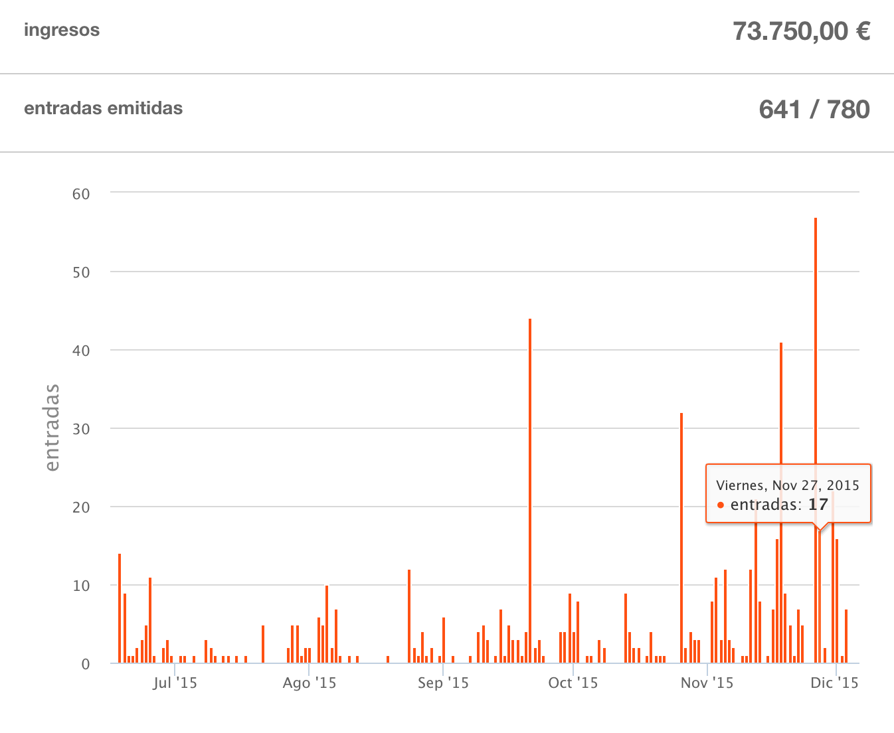
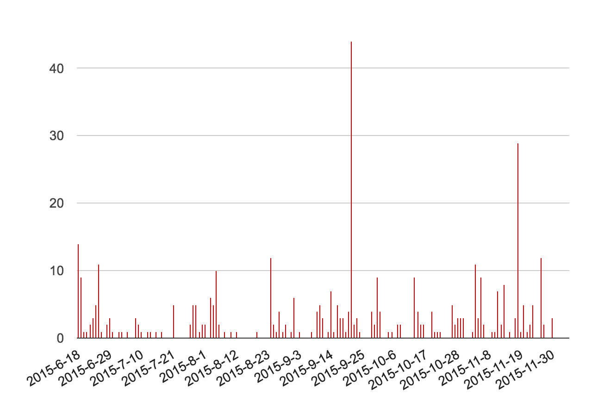

In the [previous post about the budget](http://nhpatt.com/cas_2015_budget) I mentioned the ticket sale rhythm, based on this image:

## Cause of spikes in sales

This graph does not represent the real rhythm of sales because it includes tickets created by me and associated to 
sponsorships, speakers or last week tickets (more on this later).

This is the real sales graph:

There are less weird spikes. In fact there are only few days where we sold more than 10 tickets and **we can 
map them to special events**, the more important being:

* 21/09 with 44 tickets sold was the **last day of the early bird discount**. 
Unsurprisingly all attendees waited for the last day to buy the ticket.
* 18/11 with 29 tickets sold was the **last day with the regular ticket price**. After that day the
tickets cost 350€ (!).

Apart from those dates we can identify more spikes:

* 18/06 was the date we started selling tickets
* 25/06 with 11 tickets was the next saturday after the announcement (people waited to the weekend to buy the tickets)
* 12/11 and the dates around were sales of speakers with rejected proposals, we sent the email with the rejections on that date. 

## Slow sale

We just sold 183 tickets until the 21/09 (just 2 months before the conference), for a final attendance count of 723!. 
It's exactly the 25% of the final attendance. 

I don't think this slow sale can be extrapolated to other conferences. The conference was held in Madrid and a lot of attendees didn't had
to book a hotel or plan a trip to be able to go. The way we structured the sale **didn't create any sense of urgency** (more on this later) so
most people delayed buying a ticket until the last moment.

The month distribution was this one:

<table>
    <tr>
        <th>June</th>
        <th>July</th>
        <th>August</th>
        <th>September</th>
        <th>October</th>
        <th>November</th>
    </tr>
    <tr>
        <td>53</td>
        <td>33</td>
        <td>52</td>
        <td>110</td>
        <td>50</td>
        <td>109</td>
    </tr>
</table>

Basically no sales in summer. It's a very bad idea to start selling in june. We tried to launch earlier but it was 
impossible due to several problems.

## Sales, deadlines and agenda 

We **didn't set a deadline** with the early bird tickets. We launched 150 tickets (without displaying the number left) and we waited 
until they ran out. **That was a great mistake**. 

After 3 months it was clear that we weren't going to sell them if we didn't set a deadline. 
So we set one and they basically disappeared the same day of the deadline. I *do* understand why people delay buying until 
the last moment but complicates budgeting and organizing an event enormously...

**There were no extra sales when we released the final agenda**. We just sold 3 tickets. We thought people were postponing buying
the event until the final roster but it wasn't definitely the main reason.

## Last minute tickets

We postponed (mainly me) the moment we closed the regular price tickets and launched the last-minute ones that cost 350€ (!).
I found that amount to be totally unreasonable and was based on the previous conference that also had really expensive last-minute tickets.
I lobbied hard to postpone the date until it was clear we were almost full. 

**I think it was a mistake**. The reason of the last minute tickets was forcing the sellout of the regular tickets and, when we did launch them,
they worked wonderfully. We sold 29 tickets the last day of the regular price tickets and, even more important, **we received more than thirty (!) emails**
asking for normal priced tickets. Those emails included, as I mentioned in the previous post, people that wanted to come and had booked hotels and travels but 
hadn't bought the ticket and now it was out of their budget. Or people that always attended the conference but had forgotten, or waited until the last minute, to buy
the ticket. 

We closed the regular ticket sale just two weeks after the event and we found that **we didn't had space for those (>50) unexpected attendees**. If we had
closed the regular ticket sale earlier we would have found it sooner with more time to manage those requests and cancel the sale of the last minute tickets.

That's why I think we should have started selling last minute tickets earlier, **to force people to commit to the event and reveal those emails earlier**. 
We didn't wanted to sell tickets at 350€ (at least not me), I want people to commit to the event earlier because if they wait to the last minute I can't organize it
properly. 

I can't see the future and, with just 183 tickets sold 2 months after the event, try to hire a catering, see if we have enough room on the venue or buy merchandising.

We had to send three emails to the sponsors asking them to increase their merchandising gifts because of the higher attendance. Obviously some of them couldn't manufacture/send
 more stuff with so little time left and we ran out of some swagger. The last minute tickets didn't had t-shirts because we also ran out (try to enforce that rule in the middle of the conference).
 **All these mistakes created a poor conference experience**
  
## Sense of urgency
  
There are some conferences that can sell all the tickets way ahead of the date of the conference. I obviously envy them. 
**I think we did a bad job managing expectations and creating a sense of urgency**. I'm quite bad at communicating stuff so I'm at a loss here, any suggestions are more than welcomed.

Things we tried:

* Ticket promotions with similar events (a discount on special dates)
* Heavily discounted tickets for students
* Weekly mailing list promoting the event and the speakers
* Tiered price with discount for other editions attendees (super early, early, regular and late tickets)
* Discount for groups
* Discount and promotions for sponsors, bring-your-clients ticket
* Promotions for speakers that were rejected in the call for papers
* Tweets remarking the fact that we were expecting a conference with more than 500 attendees (when we were 100 people)
* Hide the number of tickets left
* Exaggerated language ("we're almost out of tickets!")
* Post in all the social networking sites we can imagine: linkedin, facebook, twitter, lanyrd, mailing lists, meetups...
* Press notes and free tickets for press
* Contact with people directly and ask them if they are planning to attend
* ... plenty of things I've forgotten...

Things we didn't try:

* Physical promotion: posters, fliers...
* Contact someone of marketing to help us :(

At the end the conference was a success if measured only taking into account the final headcount: 723 people attended. 
As I've remarked several times, I would have loved knowing than almost 300 people would buy their ticket on the last possible moment.  

## Perception of cost and when your early bird is your regular ticket price
 
This is going to surprise you... this is the table with the ticketing options (reduced for clarity) and amounts:

<table>
    <tr>
        <th>Stud.</th>
        <th>Group</th>
        <th>Super</th>
        <th>Early</th>
        <th>Spon.</th>
        <th>Normal</th>
        <th>Late</th>
    </tr>
    <tr>
        <td>53,7€</td>
        <td>82,6€</td>
        <td>99,1€</td>
        <td>132,2€</td>
        <td>148,7€</td>
        <td>165,2€</td>
        <td>289,2€</td>
    </tr>
     <tr>
        <td>8</td>
        <td>31</td>
        <td>140</td>
        <td>152</td>
        <td>35</td>
        <td>136</td>
        <td>24</td>
    </tr>
    <tr>
        <td>1%</td>
        <td>6%</td>
        <td>27%</td>
        <td>29%</td>
        <td>7%</td>
        <td>26%</td>
        <td>5%</td>
    </tr>
</table>

Those are the prices (without VAT), amounts and percentages of the tickets sold for the students, group discount, 
super early bird (early bird for previous attendees), early bird, sponsorships, regular and last-minute tickets.

Almost **70% of the tickets** costed less than the regular ticket, less than 136 euros (without VAT). 26% of the tickets were *regular* and 5% *last minute*.

**When your early bird is the most sold type of tickets (56%), that's not your early bird, it's your regular ticket price**.

Having tickets at 200€ and 350€ only serves to spread the idea of being a expensive conference, although your mean ticket price 
is 165€... if you want to promote the idea of an exclusive conference it could be useful to promote that idea but that wasn't our case.
 
We sold 292 tickets at early bird price but people felt our conference was expensive, infused by the public prices of 200€ and 350€. 
This again, was another mistake.
 
## Final problems measuring attendance

I've explained how we sold tickets with ticketea, but if you sum all the amounts it doesn't sum 723. Where do that number comes from?

<table>
    <tr>
        <th>Sold</th>
        <th>Sponsors</th>
        <th>Transfers</th>
        <th>Speakers</th>
        <th>Press, volunteers...</th>
    </tr>
   <tr>
        <td>446</td>
        <td>96</td>
        <td>88</td>
        <td>53</td>
        <td>40</td>
    </tr>
</table>

Transfers are other type of sold tickets so 27% of the tickets were not directly bought, either because were linked to a 
sponsorship (96), belong to speakers and keynotes (53) or were free for various reasons (press, recordings, volunteers...).

**Rookie mistake**: calculate exactly how many people are going to attend to your conference with a free ticket, either 
because they are sponsors, keynotes, volunteers, speakers, press...

We did take into account all the tickets associated to a sponsorship and speakers but we set a low estimate for volunteers
and other free tickets and found we had 20 people more at the last minute, again messing up our planning.

## Things not covered here

There are some things I haven’t covered that are related to the event, things like...

* Support. I answered emails in 800 threads… what were the usual doubts? why did we have to spend so much time answering emails? 
(automate all the things!)

Maybe for a next post in a far future.

Feedback is appreciated, just send me a [tweet](https://twitter.com/nhpatt).

