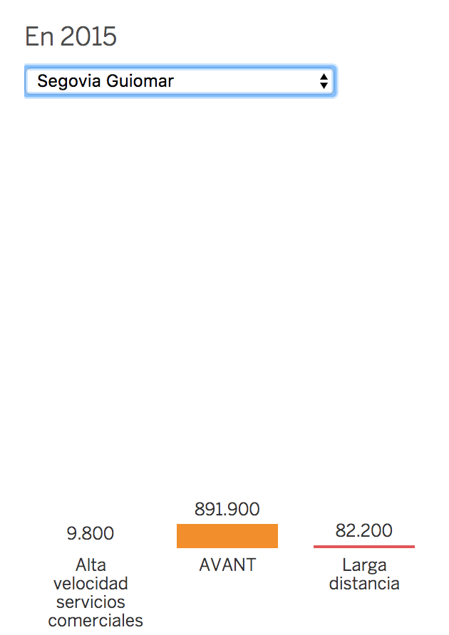
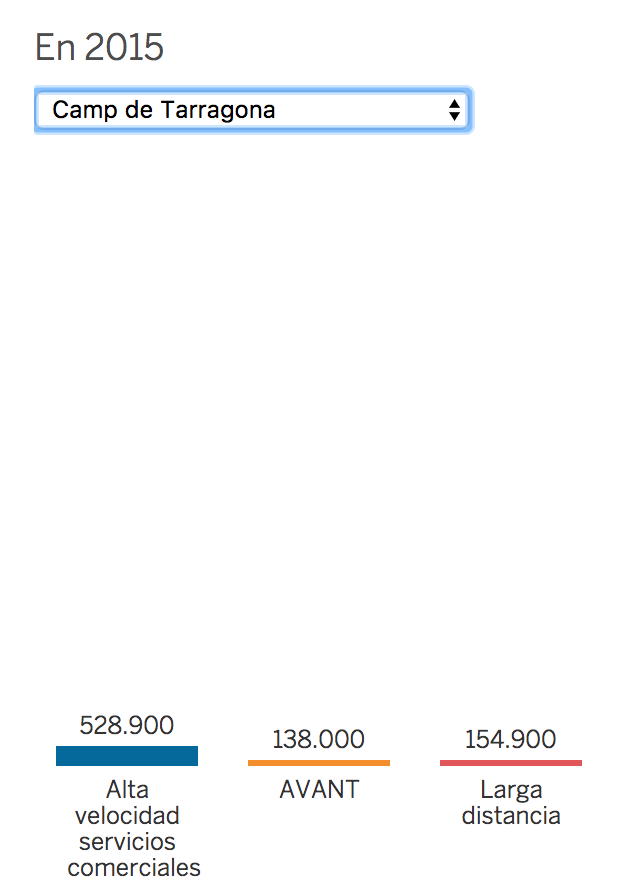
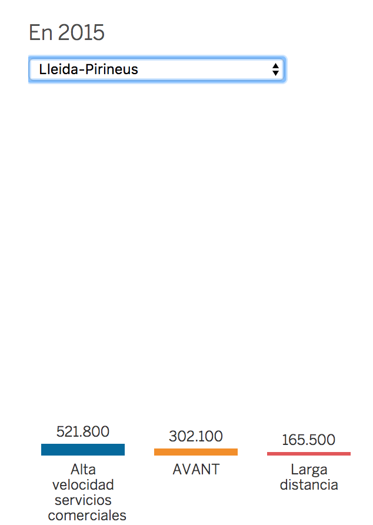
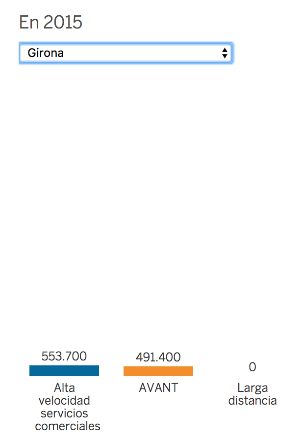
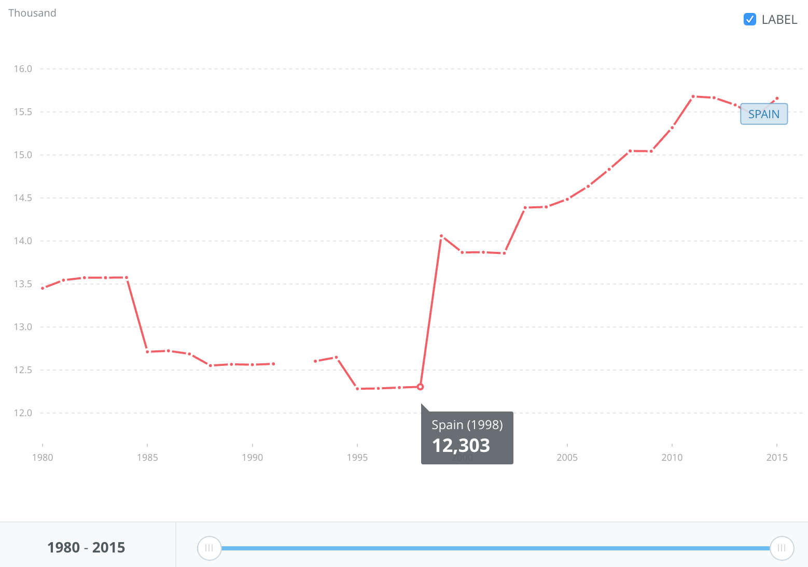
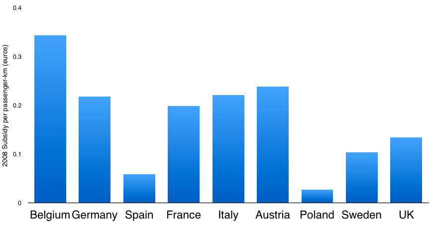
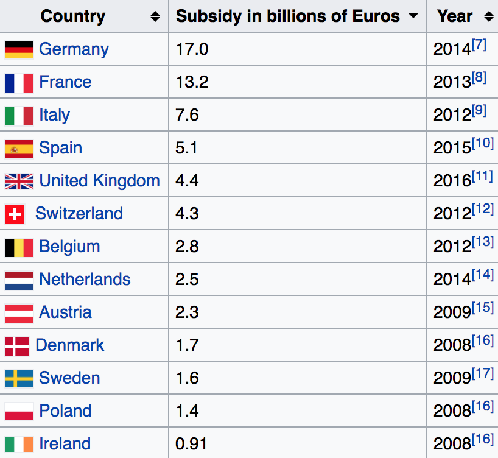
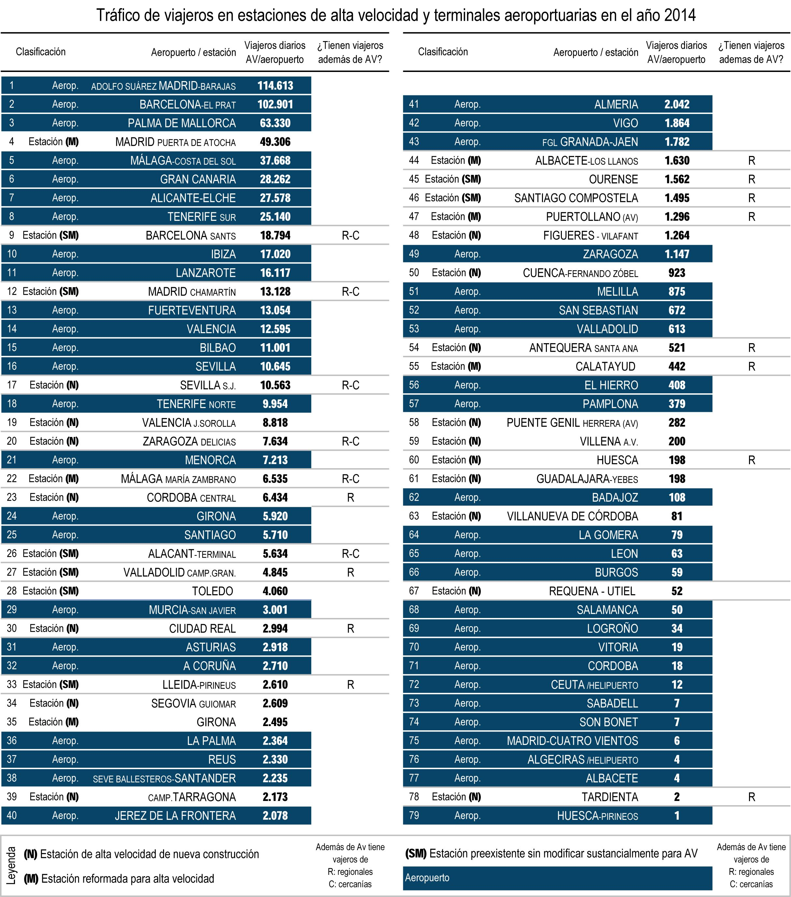

If you know me in person I'm pretty sure you already noticed that I'm a bit obsessed with data. 
**Numbers tell a story** and boy, do I love a good story! 

But it's pretty easy to cheat and bamboozle with fake numbers and tell *your* story. Let's see one example.

<blockquote class="twitter-tweet" data-lang="en">
AVE Madrid-Segovia costó 3.500M€. Transporta 14 pasajeros al día. En 25 años: 14x365x25=127.750 3.500M/127.750=27.000€ cada billete
&mdash; Chema Clavero (@jm_clavero) <a href="https://twitter.com/jm_clavero/status/896991817769603072">August 14, 2017</a></blockquote>

A quick translation: AVE (high-speed train) between Madrid-Segovia cost 3.500M€. It transports 14 passengers per day.

This tweet with almost **2000 RTs** and 1000 likes **doesn't have a single truth** in it :'(

## 3500M€

As we can read in [Wikipedia](https://es.wikipedia.org/wiki/L%C3%ADnea_de_alta_velocidad_Madrid-Segovia-Valladolid) or 
[ferropedia](http://www.ferropedia.es/wiki/LAV_Madrid_-_Segovia_-_Valladolid) those 3.500M correspond to **the cost of the 
high-speed infrastructure until the entrance to Valladolid** (161km) instead of the 68km to Segovia. That's a difference of almost 100km.

And invalidates all the calculations. You can't calculate the "amortization" of the line to Segovia based on the cost to Valladolid and use only some of Segovia passengers. 
At least you should use Valladolid passengers or calculate the cost of the line until Segovia.

The full line Madrid - Valladolid amounted to 4.200M€, 3.500M€ for 161km of high-speed railways and 700M€ in updating the Valladolid RAF (Red Arterial Ferroviaria).

## 14 passengers/day

ElPais ran a piece a year ago about the stations with less than 100 passengers/day. But it forgot to count several 
types of high-speed trains as [malaprensa](malaprensa.com/2016/05/la-alta-velocidad-esta-infrautilizada.html) 
or [vialibre](vialibre-ffe.com/noticias.asp?not=20057&cs=infr) denounced (and they even divided the amount of paying customers). 
They retracted the information and [published](https://economia.elpais.com/economia/2017/03/01/actualidad/1488362770_011434.html) an updated piece with 
the real numbers.

According to 2015 data, Segovia has 983.900 high-speed trips per year, about 2.700 each day. 
**There are 2.700 tickets sold each day, not 14**. That's a difference of almost 200x.

### What is the source of the confusion?

RENFE, the Spanish train operator, runs several commercial brands of high-speed train. The most known one is AVE but there 
are also ALVIA and AVANT. In Segovia, there is only 1 (!) train with the brand AVE that connects Segovia and Madrid in the afternoon (why?)
and 10+ high-speed trains with the other brand names. That one AVE train has 28 passengers from Segovia, 
I suppose that it comes from Valladolid with $deity knows how many passengers. The other **2670 passengers per day use the ALVIA and AVANT trains** (usually going to Madrid
in the morning and coming back in the afternoon).

The ALVIA and AVANT trains cost the same as the AVE, need the high-speed infrastructure to run and are as fast as the AVE. They are just
different commercial brands. They are even trains that go to Valladolid that are half train AVE and the other half AVANT. There are AVANT
tickets that are more expensive than ALVIA or AVE. Or AVANT trains faster than AVE (for example that mixed train). 

To "amortize" the cost of the rails **you need to count all the high-speed passengers**. If you just count the AVE ones is like you measure
the airport passengers counting just one airline. **The ALVIA or AVANT passengers are using the high-speed railway and infrastructure and paying for it**.

### Is AVE more expensive?

Let's see an example of the costs of an AVE ticket in Girona, another city that has a similar number of high-speed trips, about 1 million per year.

The ALVIA ticket for Segovia - Madrid is 24,40€ to cover (and amortize) 68km. That's 0,35€ per km. The Girona - Barcelona railway 
has a 31,40€ AVE ticket to cover 93km, 0,34€/km, slightly cheaper than the Segovia one. 

But one is ALVIA and another AVE. **Is AVE more expensive? Definitely NO**.
There are many more examples of AVEs cheaper than Segovia ALVIAs, Madrid - Sevilla AVE is less than 0,15€/km, Tarragona AVE around 0,20€/km...

In the case of Girona that has similar amount of passengers, the comparison is even worse for AVANT (Girona AVANTs are way cheaper than SEGOVIA) or taking into account
the infrastructure cost (3700M€ for 131km in Girona/Figueres vs 3500M€ for 161km in Segovia/VLL), the amount to amortize is considerably lower in Segovia. And all this 
calculus without taking into account the other traffic, that passes through Segovia but doesn't stop there. 

Even if ALVIAs were cheaper than AVEs (**that aren't**), those persons are paying for their high-speed ticket and you have to consider them as passengers!

### Lies, lies, lies...

Let's review the sentence:

"*AVE Madrid-Segovia cost 3.500M€*" -> lie. The railway infrastructure (with the station) between Madrid and the entrance to Valladolid cost 3.500M€.

"*It transports 14 passengers a day*" -> That high-speed railway transports 2700 passengers a day to Segovia alone. And 4? 5? times more to Valladolid, Palencia, León, Galicia, Asturias or Basque Country as we'll discuss later.

## 25 years

This one is funny. Why use 25 years as the period to amortize? (let's talk later about why amortize at all). Why not 35?

For example, the AVE to Sevilla is celebrating its 25th birthday. Do we want to earn money from it now? Is it going to stop working tomorrow? 
It's obvious that it's being used by millions each year and that is going to be popular for at least the next 10 years.

The point is that railway infrastructure can be amortized in longer periods than 25 years. At least until flying cars are available and that doesn't seem close.

I don't think we can expect that we are going to keep using the same infrastructure as we are doing right now in the next 125 years. 
But we'll have to tell that story to the citizens of Extremadura, that are using 
[railways](https://economia.elpais.com/economia/2017/07/20/actualidad/1500561423_276991.html) (and beams!) from the XIX century :'(

## 14x365x25=127.750 3.500M/127.750=27.000€

So, 3.5000M, 14 and 25 are wrong. What else is wrong? **the number of passengers again!**

To calculate how expensive could be a ticket you have to count how many passengers are using the railway (apart from maintenance costs).

It's not enough with the 1M passengers a year that go Segovia - Madrid and back. You have to count all the trains that go to Valladolid, León, Galicia, Palencia, Burgos, Basque Country...
because **they are using the railway and paying for it**. When I buy a 50€ ticket to León part of that money goes to pay the first 161km, ideally proportionally according to the 
amount to amortize in each part of the journey. It's obvious that those 50€ can't be just for paying the last leg of the journey that ends in León.

So, how many passengers are paying and traveling the Madrid - Segovia's leg? millions. It's the first part of the journey to the north west of Spain. 
That includes, but not limited to 2+ million annually to Valladolid, 3+ million to Galicia-León-Asturias, Basque Country...

**We can't travel to the north-north west of Spain without passing through Segovia**. At least until we can teleport trains. 
So if we want to connect Madrid with the Basque Country we have to cross Segovia.

How many high-speed passengers are passing through that railway? I don't know for sure, it's not easy to calculate. But at least 4 million more annually (as Chamartin data reflects).

That *14* passengers **are wrong by a factor of more than 1000!**.

## Politics & other data

The purpose of that tweet is politic, to announce the waste of resources in the Spanish high-speed train infrastructure. 
The criticism of the Segovia line is ironic because 3 of the 4 lines in Catalonia have equal or fewer passengers than Segovia: 
Camp Tarragona, Lleida, and Girona.

We can see it here:

Does it make sense to close the Tarragona and Lleida train stations? No. Because they're *free* in a sense, the train Madrid to Barcelona, that
has many passengers, passes through those stations. It's the same that happens with Segovia, all the trains to the northwest have to pass through there. 
Some will stop and others will not.

Girona makes less sense. The trains to France have not been successful and the station has way less traffic than Segovia or Camp Tarragona. 
The maintenance cost of the Segovia station (around 100.000k€ year) is also a third of all those stations (around 300.000k€/year).

## Reactions

I tweeted a lot on Monday afternoon and Tuesday. In fact, **I wrote 138 tweets**!

Some people (about 100) replied to the original tweet, some with snarky comments like "why don't we buy cars for those 14" or "how many wagons, they fit in the cafeteria!"
and lots of "typical Spain".

**Only 2 people told me I was right**, most of the replies to the original tweet didn't answer my corrections and the rest tried to change the subject (airports was a popular topic among those).

People are unable to say "you are right, the numbers are wrong". I did that several times when they responded questioning the 
maintainability of the whole infrastructure or I agreed with them when discussing the benefits of investing in suburban trains against
long distance ones. I find it very sad that you can't say "I don't know".

And some of them told me I was wrong. That it didn't matter what I was saying, that the point was still valid. Or I was lying. It didn't matter the argument, they were right.

I left the discussion feeling angry and confused. I was surprised thinking that someone believes that we are paying 27.000€ for a ticket train.

The author of the original tweet never replied.

# Let's leave numbers aside, I have some questions...

### Why do people believe that?

I don't know. It fits their belief system. It supports their biases (and the news that I consume support mine). [Confirmation bias](https://youarenotsosmart.com/2010/06/23/confirmation-bias/)?

### Why Spain has so many high-speed trains?

That's a very good question! It's not as easy to say that it's because of politicians love for shiny things and win votes. That helps too, of course,
but the main reason is historic.

Spain does not have a real train infrastructure. We currently have 15.000km of railways, 3.000km being high-speed train.
 
For comparison, we have fewer km of railways than the United Kingdom with double the surface. Germany has 33.000km (more than double) 
with 2/3 of the surface of Spain. France km double us. Spain conventional railways are **older, slower and fewer than our European counterparts**. 
And I haven't even mentioned the [Iberian gauge](https://en.wikipedia.org/wiki/Iberian_gauge) (!). 

This is the, depressing, Spanish graph:

We didn't invest on trains 50 or 100 years ago. And when politicians and technicians decided to build trains or retrace older infrastructure they chose to 
build high-speed trains to try to compensate for the unexisting infrastructure. They tried to bridge our technological gap by building high-speed railways 
instead of conventional ones. 

The new railways had to be rebuild from the ground either way because the older paths were built when building tunnels or bridges was unfeasible and had many 
detours because of the orography of the terrain. So instead of completely new conventional tracks, they chose completely new high-speed tracks.

It is a debatable decision in some places. Yes. But it's not an arbitrary decision or because "I said so". 

Are we spending a lot compared to our peers? per passenger:

And in absolute numbers:

### Why trains have to be amortized?

I don't know. Do you know why? We don't expect to earn money with subways, suburban trains, roads, highways, ports, stadiums, hospitals, schools, universities... but 
high-speed train should pay for itself.

Let's make something clear, some train lines pay the operational costs, what you spend each year in personnel, repairments, new trains. Subways or suburban trains don't, they need
money from the government yearly. We are talking about paying the infrastructure cost, what it cost to set the railway in place.

There are some good arguments in favor of amortizing all the cost: high-speed train is not a very *social* or *redistributive* 
investment. But neither are [mortgages](https://politikon.es/2017/07/25/deducciones-hipotecas-y-regalos-para-ricos/) (poor people can't even think about buying a house) nor [universities](https://politikon.es/2013/06/25/como-no-pagar-la-educacion-superior/) (yeah, really, 
poor people can't go to the university, they have to work to be able to survive). There are lots of paper about this, so please yell at me in [twitter](https://twitter.com/nhpatt).

## Final words

And that's all. 

At the end of a long (holiday!) day of tweeting counterarguments, I reviewed some of my tweets. And lots of them were
sarcastic and mean meant :(

When another guy corrected the bad tweet with a bad tone I tried to calm him down. 
He said sorry and "I'm seeing so many lies here that I got heated up". And I answered that I felt the same way that day and 
the previous one. **The impotence of seeing lies spreading around and knowing that you can't do anything to stop it**.

At the end of the day, there are more than 2000 people that believe that their money is paying for the private taxi of
14 persons from Segovia. And this post will be read by fewer than those famous 14 persons from Segovia. 
And I found it so depressing.

You can learn a lot about trains in this [recompilation of posts](https://politikon.es/2017/04/25/25-anos-de-ave-una-antologia/) (pro high-speed train) 
or reading the [FEDEA articles](http://nadaesgratis.es/gerard-llobet/el-pozo-sin-fondo-del-ave) (against high-speed train). 

I'm not an expert and I
apologize for all the mistakes that can't be found in this blog post. I'm available on [twitter](https://twitter.com/nhpatt) if you want to discuss it (:D).

## Postdata:

Here is a table with the data from 2014 ([ElPais](https://economia.elpais.com/economia/2017/03/01/actualidad/1488362770_011434.html) has the 2015 data) with airports and train stations:

And here I made a GIF to show you how many AVEs are available in a trip Segovia - Madrid:

