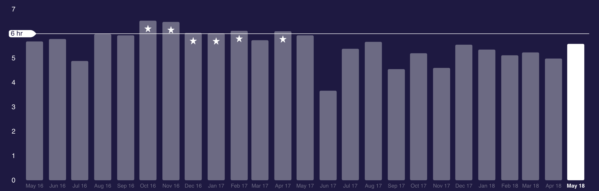

I'm tired. And I have too many things to do. **Juggling so many balls makes me extremely unproductive** at work and with my 
personal projects.

I thought I was sleeping more than I used to do (and I definitely am if I check 2013 or before) but it's not true for recent years:

And **I'm failing miserably in focus**, especially focusing in just one task at a time.

This last year has been quite chaotic and I've lived with the nagging feeling, and fact as shown in JIRA, that I'm not being as productive 
as I was before.

So the plan is slowing down after the lechazoconf and rest.