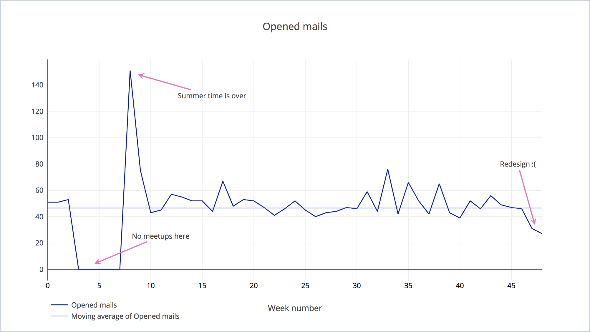
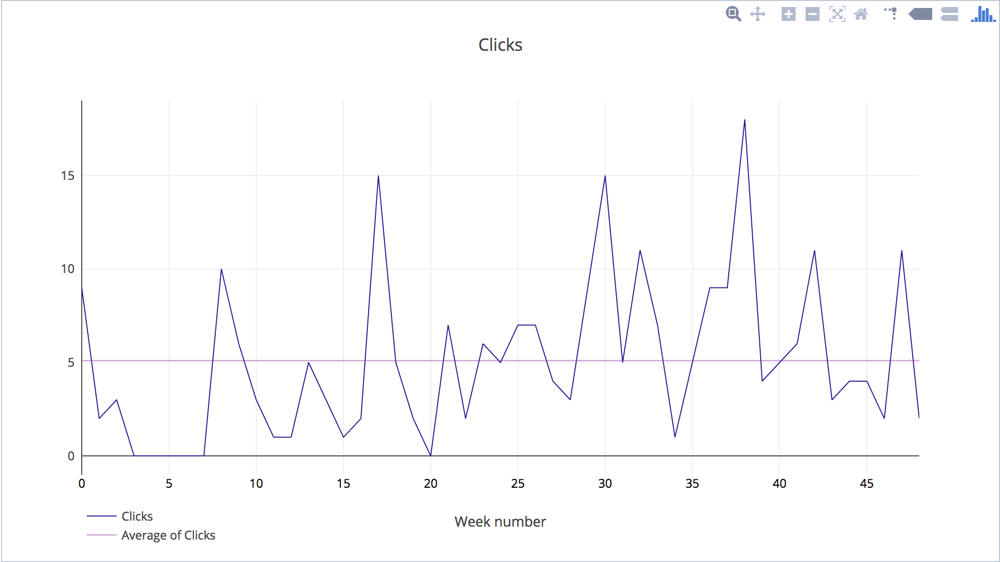
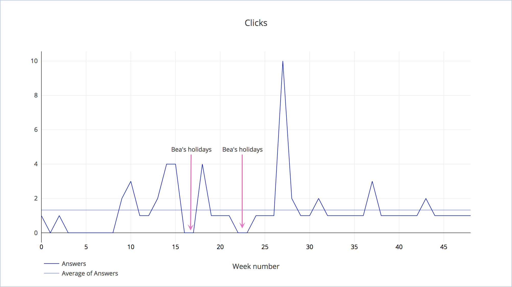

Every Thursday I send an email to the whole office (about 50 people when I started, 90 now) with a list of the
meetups we are hosting in our office.

I've been doing it for the last 2 years, with 4 different designs and 2 platforms. Here is some data about it.

And, as you can see, the opened rate is pretty much constant, although the number of recipients keeps growing. The latest redesign seems to be unsuccessful but I’m going to stick with it until September (to check if it’s just because we’re in summer).

My main gripe with this visualization is the low amount of information that transmits. There aren’t noticeable patterns and too few identified fluctuations. It would be more interesting if the data fluctuated more (with root causes identified) or with more data points. Among other things, the week number label is pretty much useless but I’m too lazy to transcribe by hand the exact date.

I have more data of the previous months, recorded with Google Analytics, but it’s pretty much inconsistent (wild fluctuations), I don’t trust myself adding the invisible image of 1px to track. MailChimp has quite a comprehensive tracking (records the daily open rate and compares with other, similar, mailing lists) but I can’t compare across campaigns in the free tier.

But I want to also show you the links clicked:

As you can imagine the clicks depends on the content: quality (games, liferay, and outlandish claims are more successful)
and quantity (more meetups means more clicks).

And, lastly, I want to show the emails received after sending the mailing list:

Basically, there is one person that always answers to the email to say thanks (THANK YOU BEA!) :)

## So what can we learn of this?

* The mailing list is becoming useless, it’s not growing (with the redesign is even decreasing) and it doesn’t have a lot of engagement.
* I can’t compare analytics data with MailChimp because the latter is very unreliable. **Capture good data**.
* I don’t have a list of events to compare with the fluctuations of the data. **Store annotated information**.
* Data processing and analyzing takes a lot of time unless you have a tool/automated process.