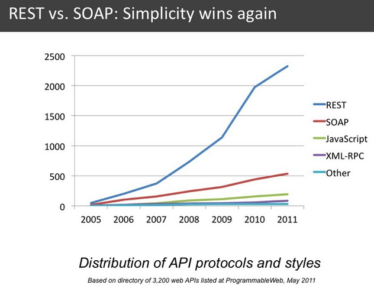

I've continued reading [REST: from research to practice](https://www.goodreads.com/book/show/11865715-rest) and, as expected, Amundsen's chapter was the best one. Let's see the relevant parts of the next 4 chapters:

## REST and Web Services: In Theory and in Practice

A comparison between WS–* (SOAP and more) and REST services, focused on the current (2011) popularity and architectural differences. There are several, laughable (IMHO), cites:

    On the level of architectural principles, (...) analyze three principles (protocol layering, dealing with heterogeneity, and loose coupling) and note that both styles support these three principles. However, they can identify only one aspect common to both styles – loose coupling to location (or dynamic late binding).

To be fair, it's from a paper the authors are analyzing... I think that those high-level analysis (disregarding developer experience, simplicity, actual code...) are deeply flawed. With that analysis the paper authors achieve this conclusion:

    Based on these results, the authors recommend using REST for ad-hoc integration and using WS– for enterprise-level application integration where transactions, reliability, and message-level security are critical.
    
    


Still, it was 2011 and people were trying to second guess who was going to win (spoiler, REST did). The authors did a survey of existing web services, they compare several "REST" frameworks (Django, JAX-RS...) and they arrive at this conclusion:
REST frameworks are not ready for the enterprise.

    Today’s frameworks are not yet ready to support enterprise needs. They do not implement advanced security features or transactions; they do not verify that HTTP methods they generate are idempotent, which is the necessary prerequisite for reliable messaging; they are not scalable.
    
We have to remember that Google, Amazon, Twitter (heck, even Instagram) **had already released successful REST APIs** back then. 

The only interesting tidbit (this chapter has suffered hard the 8-year gap) is the acknowledgment that, although REST was started in the academia in the year 2000, **universities and papers weren't studying REST at all** (the first REST workshop in academia was in 2010!). REST was picked by the industry and lost the favor of the academia. 

The chapter ends in a high note, **being hopeful of RESTful services being able to scale**, be extensible and secure.

## RESTful Domain Application Protocols

Buf. A dull example of implementing a booking system, it contains 2 relevant things:

* **Mention to [IANA’s Link Relations](https://www.iana.org/assignments/link-relations/link-relations.xhtml)**, a set of standardized types of links. To give semantic to your links (an "edit" link will mean edit the content).
* The concept of an **API home**, the first link of the application that lists all the APIs available (or operations). An example standard is [JSON Home](https://mnot.github.io/I-D/json-home/).

## Hypermedia Types

The best chapter so far.

Amundsen introduces hypermedia talking about the web and defines "Nine Hypermedia Factors", that support hypermedia behaviors. And those are:
                                                
* LO, **Outbound Links**: to be able to link to other resources. This is quite common in APIs now, like [Github](https://api.github.com/users/nhpatt).

    An example in HTML is the tag a, with links to other pages:
    
    ```html
    <a href="https://nhpatt.com">nhpatt.com</a>
    ```

* LE, **Embed Links**: to include (transclude?) linked content inside the resource. [GraphQL](https://graphql.org/) does that.

    An example in HTML is the tag for images:
    
    ```html
    
    ```

* LT, **Templates Links**: to be able to fill links with fields, github also does that: 

    ```html
    "following_url": 
      "https://api.github.com/following{/other_user}",
    ```

    An example in HTML is to create a search form (that creates a GET link with a query):

    ```html
    <form method="get" action="nhpatt.com/search">
      <input type="text" name="search" value="___" /> 
      <input type="submit" />
    </form>
    ```
  
* LN, **Non-Idempotent Links**: operations that are NOT idempotent (like POST). Basically every creation API.
 
    An example in HTML would be a basic form:
 
    ```html 
    <form method="post" action="nhpatt.com/posts/">
        <textarea name="comment"></textarea>
        <input type="submit" /> 
    </form>
    ```

* LI, **Idempotent Links**: exactly the opposite, methods that are idempotent like GET or PUT. Again, quite normal in APIs.

    In HTML, any get link:

    ```html
    <link rel="edit" href="https://nhpatt.com/edit/1"/>
    ```
    
* CU, **Update Controls**: being able to control which format you are sending or receiving. This is stranger in APIs, content-negotiation or representor pattern would be ways of achieving this :)

    In HTML, having an *enctype* property in a form would be a way of simulating it:

    ```html
    <form method="post" action="https://nhpatt.com/posts/" enctype="text/plain">
      <textarea name="content"></textarea> 
      <input type="submit" />
    </form>
    ```

* CM, **Method Controls**: being able to control the method, like sending the form with GET or POST. Again quite normal in APIs.

    In HTML would be using POST or GET to send a form (we can't use PUT, sadly).

    ```html
    <form method="post" action="..." />
      <input name="keywords" type="text" value="" /> 
      <input type="submit" />
    </form>
    ```

* CL, **Link Controls**: specifying the semantics of a link, like using IANA link relations in an API linked resources.

    In HTML the rel property would be an example of that:

    ```html
    <link rel="stylesheet" href="..." />
    ```

* CR, **Read Controls**: changing the content returned depending on something, like requesting a specific language to an API. Quite normal.

    In HTML, the AcceptLanguage header would be a great example:

    ```html
    <x:include href="http://www.exmaple.org/newsfeed" accept-language="da, en-gb;q=0.8, en;q=0.7"/>
    ```
    
Later, he analyses several formats based on this restrictions and introduces PHACTOR, a new format that checks all the boxes :)

## Beyond CRUD

REST + UML, I died here.

## Last words (for now)

**I'll be back**.

I've given several talks on REST and Hypermedia... [these](https://docs.google.com/presentation/d/1xXB2HH0P-h2fpPxKN28gYSH8cyitH85akiJNCBErQKk/edit?usp=sharing) are the slides I'm most proud of (because the theme is based on Cindy Lauper, and Cindy Lauper is God).

I'm on twitter at [nhpatt](https://twitter.com/nhpatt) if you want to read more, sporadic, ramblings :)