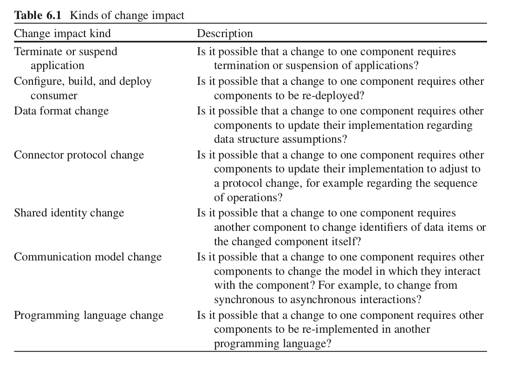
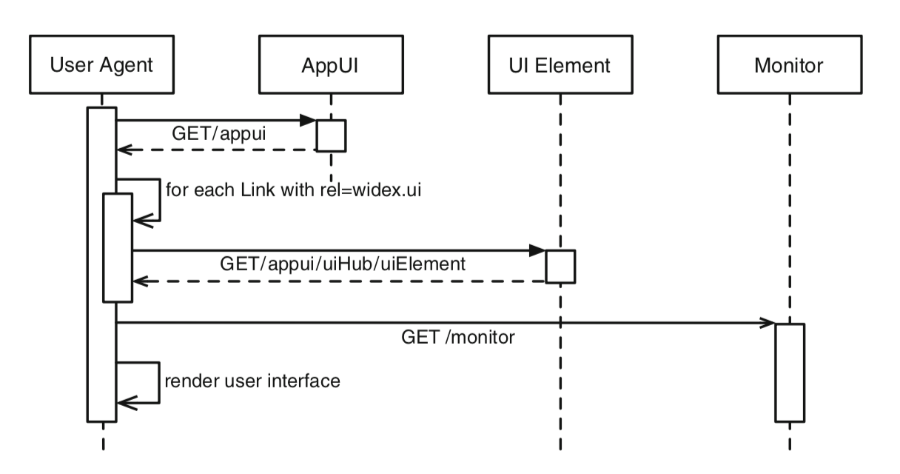
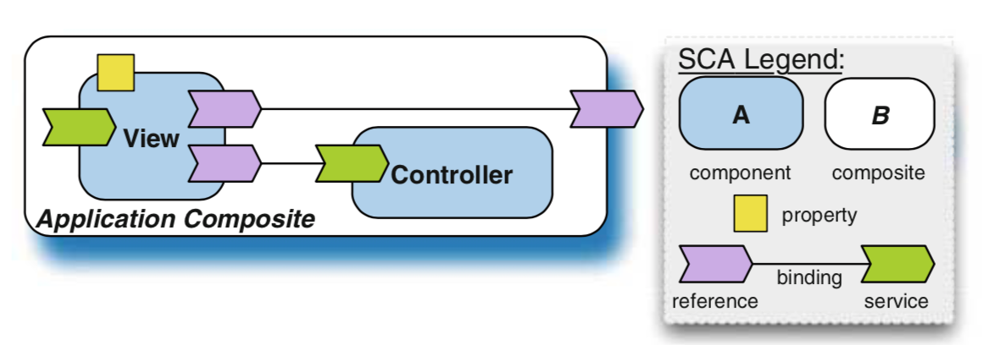
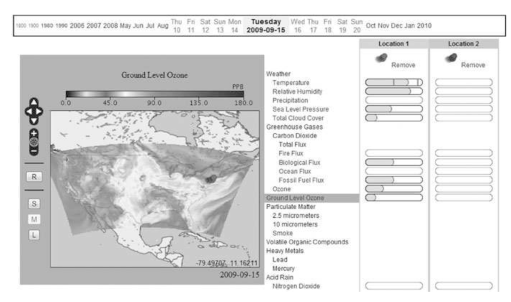

Let's continue reading [REST: from research to practice](https://www.goodreads.com/book/show/11865715-rest). I'm doing it so you do not have to (those 5 chapters were HARD).

## Quantifying Integration Architectures

Another arid paper that tries to cover how to minimize coupling with the goal of adapting to changing requirements and reduce time to market.

The chapter/paper covers several times of changes and the impact they cause:

Once classified, it tries to quantify the impact of a change in several connectors (shared files, databases, RPC APIs, REST...). Unsurprisingly, REST wins. And that's, more or less, all of it.

## FOREST: An Interacting Object Web

FOREST is an acronym for "Functional Observer REST"... a pull and push hybrid model based on GET and POST requests.

The paper explains how using POST as an idempotent (!) operation as an alternative to PUT and DELETE is a good idea. Also, return failures as an internal state with 200 and not use HTTP standard status codes has bitten me in the past.

I'm up for "implement domain logic as functional dependencies between objects’ state" but I don't think this approach is intuitive for other developers...

## Hypermedia-Driven Framework for Scalable and Adaptive Application Sharing

Interface rendering in the server... interesting use case. The chapter details the architecture decisions and the implementation with Qt.

But the implementation is wonky, 2011 wasn't the JS era and the authors have to do at least a request for each user interface element (67 requests!).

Apart from that, although the use case is interesting, there is not a lot to learn REST-related here.

## RESTful Service Development for Resource-Constrained Environments

Smart Home + [SCA](https://en.wikipedia.org/wiki/Service_Component_Architecture) + REST. Pass.

## A REST Framework for Dynamic Client Environments

The chapter tries to simulate a *progressive enhancement* framework (more like *graceful degradation*) in the backend + REST. But it does not describe anything in detail and REST-related content is close to nil. 

    "How do we combine the benefits of the REST approach to Web application design with those of active client-side features such as JavaScript and techniques such as Ajax (Asynchronous JavaScript and XML)"

## Last words (for now)

**I'll be back**.

I've given several talks on REST and Hypermedia... [these](https://docs.google.com/presentation/d/1xXB2HH0P-h2fpPxKN28gYSH8cyitH85akiJNCBErQKk/edit?usp=sharing) are the slides I'm most proud of (because the theme is based on Cindy Lauper, and Cindy Lauper is God).

I'm on twitter at [nhpatt](https://twitter.com/nhpatt) if you want to read more, sporadic, ramblings :)